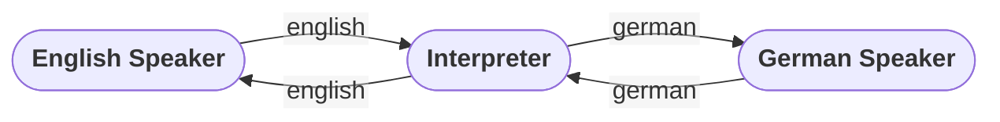

# Hello

Source: [[01_hello.py](../../code/basics/01_hello.py)]

# Introduction

Would you like to learn to control computers?
To make them do whatever you want?
But you've never programmed a computer before.
Then you're in the right place.
Welcome to the world of computer programming!

This book will teach you how to program in a language called **Python**.
But much of what you learn here will be very useful on your journey even if you eventually decide to learn and use different language.

# What is a Programming Language

You might be wondering why we need to use a programming language to control a computer or how that works.
To answer that, let's talk a little bit about how computers work.

A computer's hardware can only execute fairly simple instructions.
Any there aren't really that many different instructions.
And most of them do very simple operations like

- copy data from one location to another
- preform a math operation (add, stubtract, etc.)
- jump to a new location in the program


The instructions that a computer can understand are and **Instruction Set**.
Program's written in the language that a computer can directly understand are said to be in **Machine Code**.
Different kinds of computers have different instruction sets and therfore use different machine code.


While it may be easy for the computer to read and execute machine code, it's actually quite difficult for humans to read and write (and a lot of work).
So one of the first things early programmers did was write programs that would read simpler human-readable languages and translate them to machine code.
These were called **High-Level Languages**.


This process is more complicated now but it's actually easier.
Even thought is an extra step,
the human only needs to write the the code in the simpler language.

If that doesn't make sense yet, think about it this way...
Let's imagine you'd like to send your friend a letter.
Except your friend only speaks German and you only speak English.
How would you solve this problem?
Well, you could learn German then you could write the letter in German.
But that would be a lot of work for you.
Another approach would be to take your letter to a translator and have them convert it into German.


After translating your letter, your friend can now understand your letter.
This is how compilers work.
They translate from one language into another so that your computer can understand it.
Once your program has been compiled (translated) then you can tell the computer to run it.

# Working With an Interpreter

But that's not quite how Python works.
Let's go back to our German friend example from earlier.
Imagine that you didn't just want to send them a letter.
That's one message in one direction.
Instead, you want to have a conversation with them.
That's many messages and they go in both directions.
How would you solve this new problem?

Instead of taking your message to a translator you bring the translator to your friend.
Then they can act as an interpreter and help send messages back and forth.



This is kind of how python works.
You send the Python interpreter a command.
It translates it.
Then runs it.
And then shows you the result (if there is one).

You can start the Python interpreter by typing `python` into a terminal window:

```
C:\Users\Kiddo> python
Python 3.11.5 (tags/v3.11.5:cce6ba9, Aug 24 2023, 14:38:34) [MSC v.1936 64 bit (AMD64)] on win32
Type "help", "copyright", "credits", or "license" for more information.
>>>
```

When it starts it will print out its current version information and some other notes.
Those three arrows `>>>` at the end are called a **Prompt**.
That means that Python is waiting for you to type in a command.
Let't try it out.

```python
>>> 1 + 1
2
>>>
```

Neat, looks it can do basic math.
Let's try something harder.

```python
>>> 2352 - 1284
1068
>>>
```

Hey, pretty good.
Try it for yourself.
If punch in a formula and it will compute the result.
We can try out all kinds of neat code into the interpreter:

```python
>>> greeting = 'Good Morning'
>>> print(greeting)
Good Morning
>>>
```

When you're done, you can exit the interpreter using the `exit()` command.

```
>>> exit()
C:\Users\Kiddo>
```

But eventually it gets tiring to type in all the commands every time you want Python to do something for you.
Instead of using Python as an interactive interpreter, you can write all your commands into a file.
Then you can tell Python to run your file and it will read translate and execute the contained code and then exit.

# Writing Programs

Let's put some code in a file and file and run it using Python.

This is one of the simplest programs.
You can find the code for this example in `code\basics\01_hello.py` if you don't want to type it out.

```python
# A very simple program
print("Hello World!")
```

You can run it with the following command in a terminal window if you're in the root project folder for this book.

```
python code\basics\01_hello.py
```

It should just write the following text to the console when you run it.

```
Hello World!
```

Even thought this program is small, there are a bunch of new concepts in it that we haven't explained yet.
But don't worry if it doesn't make prefect sense yet.
Just make sure you can run it and see the expected output.

# Troubleshooting

- If you get an error when typing `python` into a terminal window, make sure you've completed the step in the [Setup Guide](../setup.md).

- If python starts but it complains that it can't find the file then it could be that either your terminal isn't in the right directory (root folder of the book) or the was a mistake in the file path given.

- If python starts but you get some kind of error message when it runs your file, most likely there is a typo (mistake in how you typed in the code). Compare your programs code with the example code very carefully. Computer can be very picky about small differences.
